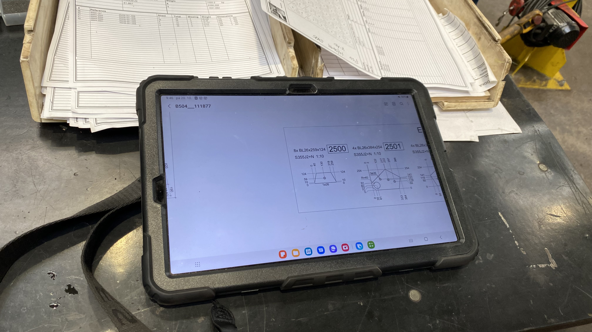
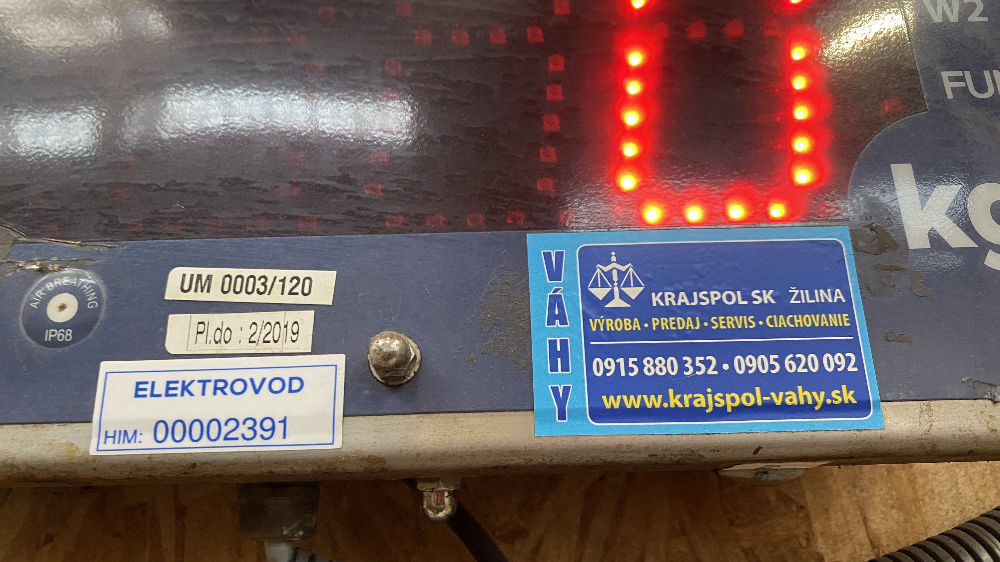

# Obecné informace
1. Elektrikář, mechanik pan Furmánek pro Elektrovod
2. U strojů, kde je možný digitální signál (řez, šlapák, sek), tento zapojit
3. Velikost terminálu minimálně 12 palců
4. U strojů ideálně tablet, viz obrázek z Hustopeč
   

# ELEKTROVOD

## Seznam strojů

### Pálící stroje
1. Kalenbach 08
2. Ficep 25
3. Ficep Gemini 63

### Ohraňovací lisy
1. Dirna 10
2. Ermak 18

### CNC
1. A204 06
2. Vernet 02
3. Vernet 04
4. Vernet 03
5. Ficep Rapid 05
6. Vernet 01

## Seznam vah

### Expedice
1. Dini Argeo (UM 0003/120)

## Seznam dotykových terminálů
1. Kalenbach 08 1ks
2. Ficep 25 1ks
3. Ficep Gemini 63 1ks
4. Dirna 10 1ks
5. Ermak 18 1ks
6. A204 06 1ks
7. Vernet 02 1ks
8. Vernet 04 1ks
9. Vernet 03 1ks
10. Ficep Rapid 051 1ks
11. Vernet 01 1ks
12. Výroba hnízdo 7ks
13. Balení hnízdo 5ks

## Počty
1. Jednotka Industrial Shields: **11ks**
2. Terminál ke stroji: **11ks**
3. Terminál hnízdo: **7ks** (výroba) plus **5ks** (balení)

## Informace k logice ke stroji
1. Přihlášení operátora
2. Typ práce (příprava, výroba, ...)
3. Evidence práce (zakázka, operace, ideálně z PLC, případně načtením čk, nebo výběrem ze seznamu z Karatu)
4. Evidence prostojů klasicky
5. Evidence poruch se zasláním emailu (více typů)
6. Evidence ok a nok kusů, položek, hmotnosti
7. Zobrazení PDF pro výrobek (z Karatu)
8. Zobrazení kontrolních formulářů (z Karatu)
9. Porovnání ks s frontou práce (z Karatu)

## Informace k logice k hnízdu
1. Přihlášení operátora
2. Načtení zakázky, operace (z Karatu)
3. Evidence začátku práce
4. Evidence konce práce včetně evidence množství

# SIGNUM

## Seznam strojů

### Provoz 1
1. Vernet VPX 250
2. Ficep Rapid 20
3. Ficep (již zapojený)
4. Vernet HD-X
5. Bystar Fiber 6000 (OPC UA protokol, měl by být)
6. Vernet Plasma MGM

### Ocelové konstrukce
1. Ohraňovací lis
2. Woortman vrtací V630
3. Kaltanbach pila
4. Omnicut MGM (dvojstroj)
5. Cortina MGM (dvojstroj)

### Sklad
1. Maxima 2500 (jen spotřeba proudu)

## Seznam vah

### Expedice
1. Dini Argeo, DGT 60 (Váhy Pecha)

### Odstředivka
1. Excel PW

## Seznam dotykových terminálů
1. Vernet VPX 250 1ks
2. Ficep Rapid 20 1ks
3. Ficep (již zapojený) 1ks
4. Vernet HD-X 1ks
5. Bystar Fiber 6000 (OPC UA protokol, měl by být) 1ks
6. Vernet Plasma MGM 1ks
7. Ohraňovací lis 1ks
8. Woortman vrtací V630 1ks
9. Kaltanbach pila 1ks
10. Omnicut MGM (dvojstroj) 1ks
11. Cortina MGM (dvojstroj) 1ks
12. Provoz 1 hnízdo 2ks
13. Expedice hnízdo 3ks
14. Ocelové konstrukce hnízdo 4ks
15. Rova hala hnízdo 1ks
16. Údržba hnízdo 1ks

## Počty
1. Jednotka Industrial Shields: **12ks** (u dvojstroje MGM celkem 3ks)
2. Terminál ke stroji: **12ks** (včetně k původně osazenému stroji)
3. Terminál hnízdo: **11ks**

## Informace k logice ke stroji
1. Přihlášení operátora
2. Typ práce (příprava, výroba, ...)
3. Evidence práce (zakázka, operace, ideálně z PLC, případně načtením čk, nebo výběrem ze seznamu z Karatu)
4. Evidence prostojů klasicky
5. Evidence poruch se zasláním emailu (více typů)
6. Evidence ok a nok kusů, položek, hmotnosti
7. Zobrazení PDF pro výrobek (z Karatu)
8. Zobrazení kontrolních formulářů (z Karatu)
9. Porovnání ks s frontou práce (z Karatu)

## Informace k logice k hnízdu
1. Přihlášení operátora
2. Načtení zakázky, operace (z Karatu)
3. Evidence začátku práce
4. Evidence konce práce včetně evidence množství

## Obrázky

### Elektrovod váha

