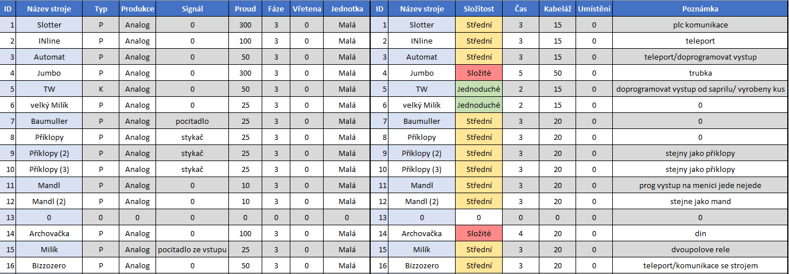
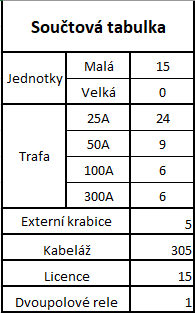

# SAPRIL

# Obecné informace, nesetříděné
1. Elektrikář, mechanik pan Vatrt Daniel tel. 732285485
2. U všech strojů budu zapojeny proudové transformátory pro měření odebíraného proudu
3. U strojů kde je možný digitální vstup budou osazeny příslušné digitální vstupy

## Seznam strojů

### Pálící stroje
1. Slotter
2. INline
3. Automat
4. Jumbo
5. TW
6. Velký milík
7. Baumuller
8. Příklopy
9. Příklopy (2)
10. Příklopy (3)
11. Mandl
12. Mandl (2)
13. Archovačka
14. Milík
15. Bizzozero

## Další informace k instalaci

Počet externích krabic **5 ks** (z důvodu malého místa v rozvodné skříni budou jednotky osazeny do externích krabic)
Pro vybrané stroje, dle seznamu níže je potřeba doprogramovat digitální výstup kusu (kontakt na příslušného elektrikáře je uvedený výše)

### Seznam strojů

### Součtová tabulka HW

