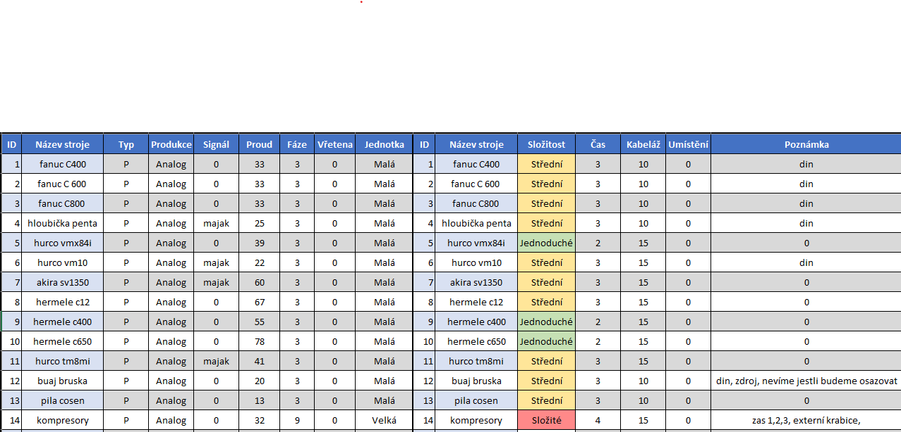
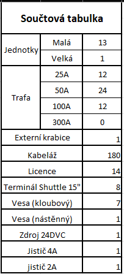

# STEELFORM

# Obecné informace, nesetříděné
1. IT správa serveru Pavel Štěpánek, tel. 774 108 100, email pavel.stepanek@steelform.cz
2. U strojů budou převážně zapojeny proudové transformátory
3. Digitální signály, které bude možnost připojit budou přijeny (např. maják)
4. Terminály budou osazeny na pracovních stolech na vesa ramenu (vesa držáky budou přidělány z boční strany stolu)

## Seznam strojů

1. fanuc C400
2. fanuc C600
3. fanuc C800
4. Hloubička penta
5. hurco vmx84i
6. hurco vm10
7. akira sv1350
8. hermele c12
9. hermele c400
10. hermele c650
11. hurco tm8i
12. buaj bruska
13.  pila cosen
14. kompresory

## celkový hardware

- Celkem bude připojeno 13 strojů (13 malých jednotek, 1 velká jednotka)
  
  Při analýze bylo zjištěno, že bude potřeba:
  - **12 kusů** 25A proudových transformátorů
  - **24 kusů** 50A proudových transformátorů
  - **12 kusů** 100A proudových transformátorů 
  
  - **4 kusy relé** pro připojení majáku na určité stroje.
  - **1 kus** externí krabice (jednotka se nevleze do stroje)

  ### dotykové terminály

  - dotykových terminálů 8 kusů, k dotykovým terminálům je potřeba přivést ethernetový kabel (nemají wifi)
  - Dotykové terminály budou připevněny na vesa držák
   - **7 kusů** kloubových stolník
   - **1 kus** nástěnný.

## Tabulky
### Seznam strojů

### Součtová tabulka

