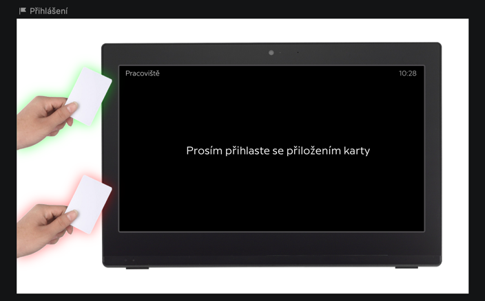
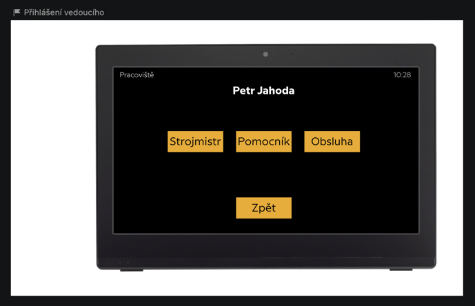
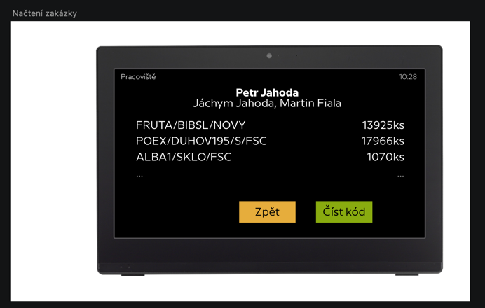
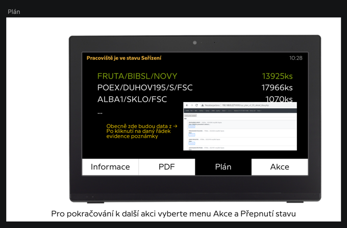
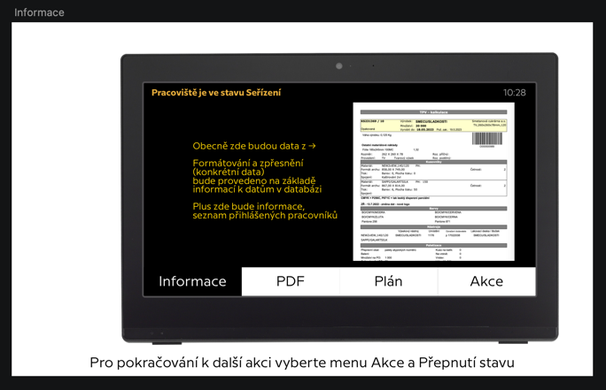
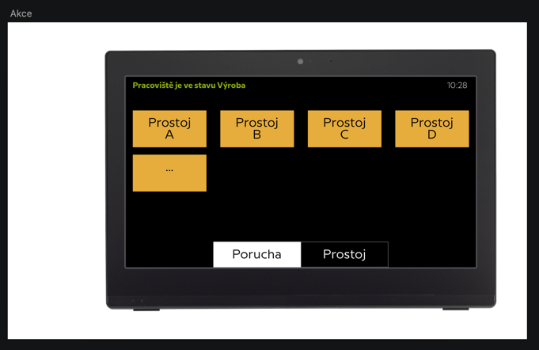

# POKART data structure

## Users

| Pokart                          | Bartech                  |
|---------------------------------|--------------------------|
| AXIOM.FDB.PRACOVNIK.IDPRACOVIK  | system.users.note        |
| AXIOM.FDB.PRACOVNIK.JMENO_PR    | system.users.first_name  |
| AXIOM.FDB.PRACOVNIK.JMENO_PR    | system.users.second_name |
| AXIOM.FDB.PRACOVNIK.POPISZAR_PR | system.users.rfid        |
| AXIOM.FDB.PRACOVNIK.CARKOD_PR   | system.users.barcode     |

### Where is it displayed on terminal?



## User_types

| Pokart | Bartech                |
|--------|------------------------|
| -      | system.user_types.name |

There will be these types created:

- Strojmistr
- Pomocník
- Obsluha
- Kontrola

### Where is it displayed on terminal?

!

## Orders

```SELECT * FROM `planvyroby_prac` WHERE `stroj` LIKE 'KBA_Rapida' and zakazka not like 'Prostoj' ORDER BY `planvyroby_prac`.`row_order` ASC, `planvyroby_prac`.`casprichodu` ASC```

| Pokart                             | Bartech                                    |
|------------------------------------|--------------------------------------------|
| axiom.planvyroby_prac.idPolPlan    | system.pokart_orders.plan_id               |
| axiom.planvyroby_prac.stroj        | system.pokart_orders.workplace             |
| axiom.planvyroby_prac.zakazka      | system.pokart_orders.order_name            |
| axiom.planvyroby_prac.kupnismlouva | system.pokart_orders.order_additional_info |
| axiom.planvyroby_prac.polozka      | system.pokart_orders.product_barcode       |
| axiom.planvyroby_prac.vyrobek      | system.pokart_orders.product_name          |
| axiom.planvyroby_prac.pocet        | system.pokart_orders.count                 |
| axiom.planvyroby_prac.pocnaarchu   | system.pokart_orders.sheet_multiplier      |
| axiom.planvyroby_prac.pocarchu     | system.pokart_orders.sheet_count           |
| axiom.planvyroby_prac.casprichodu  | system.pokart_orders.date_time_start       |
| axiom.planvyroby_prac.casodchodu   | system.pokart_orders.date_time_end         |
| axiom.planvyroby_prac.trvani       | system.pokart_orders.duration              |
| axiom.planvyroby_prac.odberatel    | system.pokart_orders.customer_name         |
| axiom.planvyroby_prac.id           | system.pokart_orders.external_id           |
| axiom.planvyroby_prac.row_order    | system.pokart_orders.row_order             |
| axiom.planvyroby_prac.datumUlozeni | system.pokart_orders.date_time_created     |
| axiom.planvyroby_prac.poznamka     | system.pokart_orders.note                  |
| axiom.planvyroby_prac.tisknout     | system.pokart_orders.print                 |

### Where is it displayed on terminal?

 

## Order information

### Foreign keys

| Order                         | Order information                       |
|-------------------------------|-----------------------------------------|
| axiom.planvyroby_prac.polozka | AXIOM.FDB.OBL_TPV.TPV_IDOBJPOL          |
| axiom.planvyroby_prac.polozka | AXIOM.FDB.OBL_BARKUS.IDOBJPOL           |
| axiom.planvyroby_prac.polozka | AXIOM.FDB.OBL_TPV_NASTROJE.OTN_IDOBJPOL |
| axiom.planvyroby_prac.polozka | AXIOM.FDB.OBL_TPV_VYROBEK.TV_ID_OBJPOL  |
| axiom.planvyroby_prac.polozka | AXIOM.FDB.OBL_TPV_OPR.OPR_IDOBJPOL      |

#### Main information table

| Pokart                                | Bartech                                       | Display name    |
|---------------------------------------|-----------------------------------------------|-----------------|
| system.pokart_orders.id               | system.pokart_order_information.order_id      | -               |
| axiom.planvyroby_prac.polozka         | system.pokart_order_information.product       | -               |
| AXIOM.FDB.OBL_TPV.MAT_ID              | system.pokart_order_information.material_name | Materiál        |
| AXIOM.FDB.OBL_TPV.TPV_FORMAT_ARCHU1   | system.pokart_order_information.sheet_name    | Formát archu    |
| AXIOM.FDB.OBL_TPV.TPV_FORMAT_ARCHU2   | system.pokart_order_information.sheet_name    | Formát archu    |
| AXIOM.FDB.OBL_TPV.TPV_POCETBAREV      | system.pokart_order_information.color_count   | Tisk            |
| -                                     | system.pokart_order_information.connection    | Spojení         |
| AXIOM.FDB.OBL_TPV.TPV_PLOSNA_HMOTNOST | system.pokart_order_information.weight        | Plošná hmotnost |
| AXIOM.FDB.OBL_TPV.TPV_FORMAT_CETNOST  | system.pokart_order_information.sheet_count   | Četnost         |

#### Additional packages table

| Pokart                                          | Bartech                                                       | Display name                    |
|-------------------------------------------------|---------------------------------------------------------------|---------------------------------|
| system.pokart_order_information.id              | system.pokart_order_information_packages.order_information_id |                                 |
| AXIOM.FDB.OBL_TPV_VYROBEK.TV_ID_PREPRAVNI_OBAL  | system.pokart_order_information_packages.package_name         | Přepravní obal                  |
| AXIOM.FDB.OBL_TPV_VYROBEK.TV_MNOZSTVI_NA_PALETE | system.pokart_order_information_packages.package_pcs          | Množství na přepravním obalu    |
| AXIOM.FDB.OBL_TPV_VYROBEK.TV_POCET_PALET        | system.pokart_order_information_packages.package_count        | Celkový počet přepravních obalů |
| AXIOM.FDB.OBL_TPV_VYROBEK.TV_KUSU_NA_BALENI     | system.pokart_order_information_packages.package_per_pcs      | Kusů na balík                   |
| AXIOM.FDB.OBL_TPV_VYROBEK.TV_VRSTEV_NA_PALETE   | system.pokart_order_information_packages.layer_count          | Celkový počet vrstev            |
| AXIOM.FDB.OBL_TPV_VYROBEK.TV_VYROBKU_NA_VRSTVE  | system.pokart_order_information_packages.layer_per_pcs        | Kusů na vrstvě                  |
| -                                               | system.pokart_order_information_packages.weight               | Váha                            |

#### Additional colors table

| Pokart                             | Bartech                                                     | Bartech_foreign_key                | Display name |
|------------------------------------|-------------------------------------------------------------|------------------------------------|--------------|
| system.pokart_order_information.id | system.pokart_order_information_colors.order_information_id |                                    |
| AXIOM.FDB.OBL_BARKUS.IDRECEPTY     | system.pokart_order_information_colors.color_name           | system.pokart_order_information.id | Barva        |

#### Additional tools table

| Pokart                                         | Bartech                                                    | Display name        |
|------------------------------------------------|------------------------------------------------------------|---------------------|
| system.pokart_order_information.id             | system.pokart_order_information_tools.order_information_id |                     |
| AXIOM.FDB.OBL_NASTROJV.NSV_MISTO_NASTROJE      | system.pokart_order_information_tools.tool_location_name   | Místo nástroje      |
| AXIOM.FDB.OBL_NASTROJV.NSV_UMISTENI            | system.pokart_order_information_tools.tool_location_number | Umístění            |
| AXIOM.FDB.OBL_NASTROJV.NSV_OZNACENI_DODAVATELE | system.pokart_order_information_tools.tool_supplier        | Označení dodavatele |
| AXIOM.FDB.OBL_NASTROJT.NST_NAZEV               | system.pokart_order_information_tools.tool_name            | Lakovací deska      |

#### Additional operations table

| Pokart                               | Bartech                                                         | Display name |
|--------------------------------------|-----------------------------------------------------------------|--------------|
| system.pokart_order_information.id   | system.pokart_order_information_operations.order_information_id |              |
| AXIOM.FDB.OBL_TPV_OPR.OPR_MNOZARCHU  | system.pokart_order_information_operations.sheet_count          | Vstup        |
| AXIOM.FDB.OBL_TPV_OPR.OPR_POCETBAREV | system.pokart_order_information_operations.colors_count         | Barvy        |
| AXIOM.FDB.OBL_TPV_OPR.OPR_MNOZARCHU  | system.pokart_order_information_operations.workplace_name       | Stroj        |
| AXIOM.FDB.OBL_TPV_OPR.OPR_POZN       | system.pokart_order_information_operations.note                 | Poznámka     |

### Where is it displayed on terminal?



## Downtimes

| Pokart | Bartech               |
|--------|-----------------------|
| -      | system.downtimes.name |

## Fails

| Pokart | Bartech           |
|--------|-------------------|
| -      | system.fails.name |

Downtimes and fails will be created on demand and in realtime the standard xmost way (web interface).

### Where is it displayed on terminal?

